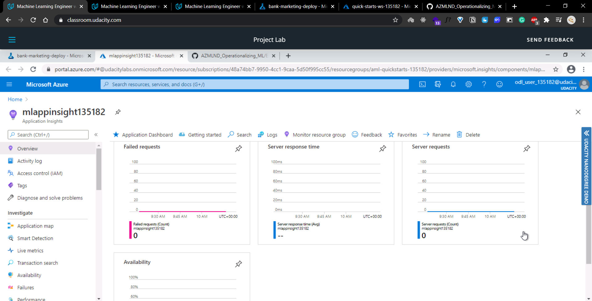
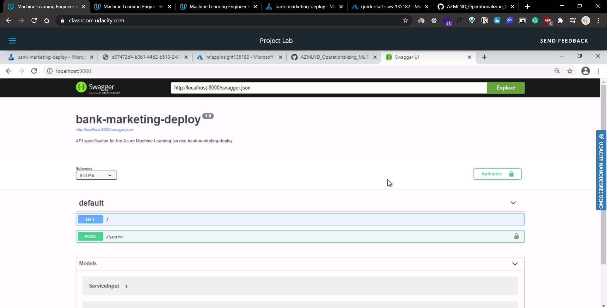

# Operationalizing Machine Learning

## Overview
_This project is a part of the Udacity Azure ML Nanodegree._ The aim of this project is to configure a cloud-based automated machine learning production model, deploy it, and consume it. The second part of the project deals with creating, publishing, and consuming a pipeline. Both the automated model as well as the pipeline uses the [Bank Marketing dataset](https://archive.ics.uci.edu/ml/datasets/Bank+Marketing).

## Architectural Diagram


## Key Steps
1. Authentication
   * This was an optional step since this experiment was conducted using the lab provided by Udacity. This skipped step required a Service Principal account to be created and associate it with our specific workspace.
1. Automated ML Experiment
   1. Data Preparation
      * This project uses a Bank Marketing Dataset from the USI Machine Learning Repository that conatins personal details about clients such as age, job, marital status, education, etc among other attributes.
      * The goal of the trained model is to predict whether or not a client will subscribe to a term deposit with the bank.
      * The data is classified using the column label y in the dataset that contains binary values ('yes' and 'no').
      * The dataset is uploaded and registered to the Azure default datastore as a Tabular Dataset using the given [csv file](https://automlsamplenotebookdata.blob.core.windows.net/automl-sample-notebook-data/bankmarketing_train.csv).
      * Shown below are images of the Registered dataset and it's details.
       
        
        
      
   1. Confugirung a Compute Cluster
      * A compute cluster was configured to run the experiment with the name `compute-cluster`. The dedicated virtual machine size of the compute cluster was `STANDARD_DS12_V2`, with `1 minumum and 6 maximum number of nodes` and `CPU` Processing unit.
      * Shown below are sreenshots of the computer cluster and the details of it's configurations used in the experiment.
      
        
        
      
   1. Submitting the autoML run
      * A new auto ML experiment was created with the name `bank-marketing-autoML`. The experiment task was `classification` with exit criteria as 1 hour and a concurrency of 5 runs. 
      * The best model out of all the tested algorithms was selected by AutoML using `Accuracy` as the primary metric.
      * Shown below is the image of the completed AutoML experiment with the best chosen algorithm as `VotingEnsemble` with an accuracy of `0.91958`.
      * Shown below is the image of the completed AutoML experiment.
        
        
      
      * Shown below is the best model and it's metrics returned by the run.
      
        
        
      
1. Deploy the best model
   * The best model was chosen as the `VotingEnsemble` Algorithm and deployed using _`Azure Container Instance (ACI)`_ with the name `bank-marketing-deploy`.
   * The `Authentication` option is enabled during deployment, authentication is enabled. Authentication is enabled to ensure unauthorized access and interaction with the deployed model.
   * After deploying the model using ACI, the deployement at hand is an interactive HTTP API Endpoint.
   * Shown below is the list of real time dployed endpoint.
   
     
  
   * Shown below are images of the deployed model's details.
   
     
     
   
1. Enable logging
   * APPLICATION INSIGHTS:
     * Once a model is deployed, Application Insights and option to retrieve logs can be enabled.
     * Although this is configurable at the time of deploy, it can also be enabled post deployement using Python SDK ny running the `logs.py` command.
     * Enabling application insights helps developers and DevOps professionals that can be used to:
       * Detect Anomalies
       * Use Powerful analytic tools to visualize performance
   * In this experiment, application insights were enabled using the python SDK by running the following command ```service.update(enable_app_insights=True)```.
   * The image below shows the log output (which is the log ouput produced by the deployed model) after running `logs.py` file.
     
     
     
   * Below are screenshots showing that the deployed model's application insights have been enabled.
   
     
     
   * The image below shows _visual representation of application insights_ for the deployed model. The link to the site is given in properties section under `Appliation Insights URL`.
     
     
     
      

1. Swagger Documentation
   * WHAT IS SWAGGER?
     * `Swagger` is a tool provided by Azure that helps build, document, and consume RESTful web services, also known as `HTTP API`. 
     * It further explains what types of HTTP requests that an API can consume, like POST and GET, the inputs that the API accepts and what are the endpoints.
     * Swagger simplifies the documentation of HTTP APIs and helps to interact with them easily without spending much time on analyzing the behavior of a model for consuming.
     * Azure provides a `swagger.json` that is used to create a web site that documents the HTTP endpoint for a deployed model.
   * In this project, `swagger.json` along with the `swagger.sh` and `serve.py` files present in the same folder, helps to get a Docker container to run locally that serves Swagger.
   * The locally serving Swagger is then used to interact with the deployed model Documentation. 
   * The `swagger.sh` used the ```docker run -p 9000:8080 swaggerapi/swagger-ui``` command that ran the swagger UI container which helped in displaying a website for the swagger documentation, which is otherwise illegible if read using the raw JSON file.
   * Once the swagger.sh file is run using the `bash` command, the container is available on local port 9000.
   * Shown below is the image of the swagger.sh run.
     
     
     
   * In the http://localhost:9000, the default swagger website and documentation appears.
   * Shown below is the default swagger website on port 9000.
     
     
   
   * The `serve.py` script is then run so that the contents of `swagger.json` can be consumed locally by Swagger, to view the specifics and documentation of the dployed model.
   * Shown below is the image of the serve.py run.
     
     
     
   * By default, the `serve.py` script runs and serves contents on of the endpoint on `localhost:8000`
      * To load the documentation of the deployed model the `http://localhost:8000/swagger.json` URL is used.
      * Shown below is an image of the documentation of the deployed endpoint. The image also shows the request methods (in this case **GET** and **POST**) that can be used to interact with the endpoint.
      
        
      
      * The **HTTP GET** request method us used to request data from the endpoint. In the image shown below the GET method returns the output data from the endpoint and it also shows sample data that will be returned on interacting with it.
      
        
        
      * The **HTTP POST** request method us used to submit data to the endpoint. In the image shown below the POST method accepts JSON file as input and it also shows sample JSON input. 
      
        

1. Consume model endpoints
   * The deployed model can be consumed via an HTTP API. An HTTP API is a URL that is exposed over the network so that interaction with a trained model can happen via HTTP requests.
   * The `HTTP POST` is a common request method that is used to submit data. 
   * The `HTTP GET` is another method used to retrieve information from a URL. 
   * The allowed **_requests methods, JSON input and output files and the different URLs exposed by Azure create a bi-directional flow of information_**.
   * In this project the `endpoint.py` script is used to interact with the trained model. 
   * After modifying both the *scoring_uri* and the *key* to match the key for the service and the URI that was generated after model deployment, the script is run.
   * The script also contains sample data in JSON format that is used score and get back results from the endpoint.
   * Shown below is the image of the output produced by `endpoint.py` run after modifying *scoring_uri* and the *key*.
   
     
   
   1. Benchmark
      * A benchmark is used to create a baseline or acceptable performance measure. Benchmarking HTTP APIs is used to find the average response time for a deployed model.
      * Apache Benchmark is an easy and popular tool for benchmarking HTTP services. It is used from the command line using the `ab` command.
      * It creates a baseline by response times and failed requests, hence making it easy to identify and rectify error rates and slow responses from the deployed model.
      * In this experiment the `benchmark.sh` is run to trugger the ab command. The command runs against the selected endpoint using the data.json file created by the same endpoint.py.
      * ```
          ab -n 10 -v 4 -p data.json -T 'application/json' -H 'Authorization: Bearer SECRETKEY' http://URL.azurecontainer.io/score
        ```
      * The secret key is to be replaced by the `primary key` and the URL by the `REST URL`, both of which are provided under the *consume* section in the deployed endpoint.
      * Below is the image that shows the `benchmark.sh` run and the output produced.
      
        
        
      * The output produced by the run on the dpeloyed model is as follows:
        1. Time per request (mean): 118.739 ms
        1. Failed Requests: 0
        1. Number of complete requests: 10
      * Below is the image that shows the output for the benchmark run.
      
        
        
1. Create and publish a pipeline
   * Pipelines are a great way to automate ML workflows.
   * Published pipelines allow external services to interact with them so that they can do work more efficiently.
   * This section of the project deals with creating, publishing and interacting with the pipelines.
   * In this experiment a previously provided starter file ipynb is used and we are required to update the notebook to have same Keys, URI, dataset, cluster and model names that was created in the first section of the experiment (AutoML Experiment).
   1. Creating a Pipeline
      * Firstly the AutoML run configuration is created using `AutoMLConfig`. 
      * Then a pipeline is created using the `Pipeline` class, imported as follows: ```from azureml.pipeline.core import Pipeline```.
      * The Pipeline ic created using the `AutoMLStep` where the actual AutoML run step takes place and the experiment is submitted using the `pipeline_run` object.
      * The image below shows that the pipeline has been created.
        
        
        
      * The image below shows the scheduled run of the Pipeline
        
        
               
   1. Publishing a Pipeline
      * After retrieving the best model from the AutoMLStep run, a piepline is published to the workspace under the name `Bank Marketing Piepline` using Python SDK and Azure ML Studio. 
      * The `publish_pipeline` objet is used to publish the created pipeline/
      * Publishing the pipeline enables a REST endpoint to rerun the pipeline from any HTTP library on any platform.      
      * The screenshot below shows the Pipeline Endpoint in the Pipelines Section of Azure ML Studio
        
        
        
      * The screenshot below shows the RunWidget in the Jupyter Notebook of the Published Pipeline run.
        
        
      * The published pipeline and it's details can be viewed in Azure ML Studio of the published pipeline run in the designer.
      * The image below shows the Published Pipeline overview and the status of the endpoint.
        
        
        


## Screen Recording
TODO Provide a link to a screen recording of the project in action. Remember that the screencast should demonstrate:

## Standout Suggestions
TODO (Optional): This is where you can provide information about any standout suggestions that you have attempted.
* Used the Apache Benchmark tool to create a measure of accepted performance for the deployed model. This was an option step that was done in this experiment
* In the future, rather than running an endpoint.py script to submit a request, a website or a similar interface can be created that can help user to enter input data for which the deployed model returns results. This can ensure a user friendly way for the users to consume and interact with the deployed model.
