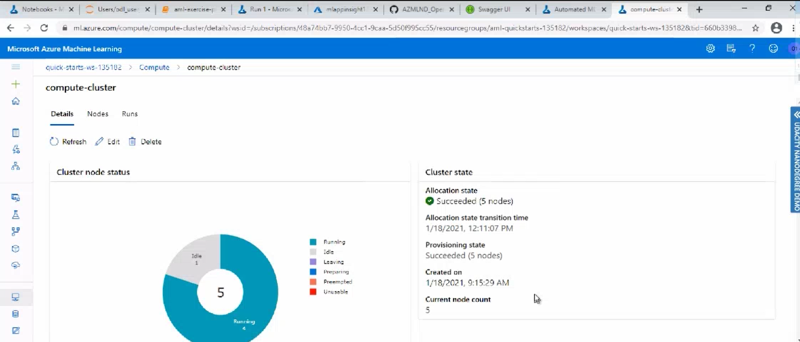

# Operationalizing Machine Learning

## Overview
_This project is a part of the Udacity Azure ML Nanodegree._ The aim of this project is to configure a cloud-based automated machine learning production model, deploy it, and consume it. The second part of the project deals with creating, publishing, and consuming a pipeline. Both the automated model as well as the pipeline uses the [Bank Marketing dataset](https://archive.ics.uci.edu/ml/datasets/Bank+Marketing).

## Architectural Diagram

## Key Steps
1. Authentication
   * This was an optional step since this experiment was conducted using the lab provided by Udacity. This skipped step required a Service Principal account to be created and associate it with our specific workspace.
1. Automated ML Experiment
   1. Data Preparation
      * This project uses a Bank Marketing Dataset from the USI Machine Learning Repository that conatins personal details about clients such as age, job, marital status, education, etc among other attributes.
      * The goal of the trained model is to predict whether or not a client will subscribe to a term deposit with the bank.
      * The data is classified using the column label y in the dataset that contains binary values ('yes' and 'no').
      * The dataset is uploaded and registered to the Azure default datastore as a Tabular Dataset using the given [csv file].(https://automlsamplenotebookdata.blob.core.windows.net/automl-sample-notebook-data/bankmarketing_train.csv).
      * Shown below are images of the Registered dataset and it's details.
      
  
  
  
      
   1. Confugirung a Compute Cluster
      * A compute cluster was configured to run the experiment with the name `compute-cluster`. The dedicated virtual machine size of the compute cluster was `STANDARD_DS12_V2`, with `1 minumum and 6 maximum number of nodes` and `CPU` Processing unit.
      * Shown below are sreenshots of the computer cluster and the details of it's configurations used in the experiment.
      
  
  
  
      
   1. Submitting the autoML run
      * A new auto ML experiment was created with the name `bank-marketing-autoML`. The experiment task was `classification` with exit criteria as 1 hour and a concurrency of 5 runs. 
      * The best model out of all the tested algorithms was selected by AutoML using `Accuracy` as the primary metric.
      * Shown below is the image of the completed AutoML experiment with the best chosen algorithm as `VotingEnsemble` with an accuracy of `0.91958`.
      * Shown below is the image of the completed AutoML experiment, best model and it's metrics returned by the run.
      
  
  
  
  
  
      
1. Deploy the best model
   * The best model was chosen as the `VotingEnsemble` Algorithm and deployed using _`Azure Container Instance (ACI)`_ with the name `bank-marketing-deploy`.
   * The `Authentication` option is enabled during deployment, authentication is enabled. Authentication is enabled to ensure unauthorized access and interaction with the deployed model.
   * After deploying the model using ACI, the deployement at hand is an interactive HTTP API Endpoint.
   * Shown below is the list of real time dployed endpoint and images of the deployed model's details.
   
  
  
  
  
  
   
1. Enable logging
1. Swagger Documentation
1. Consume model endpoints
1. Create and publish a pipeline

## Screen Recording
TODO Provide a link to a screen recording of the project in action. Remember that the screencast should demonstrate:

## Standout Suggestions
TODO (Optional): This is where you can provide information about any standout suggestions that you have attempted.
